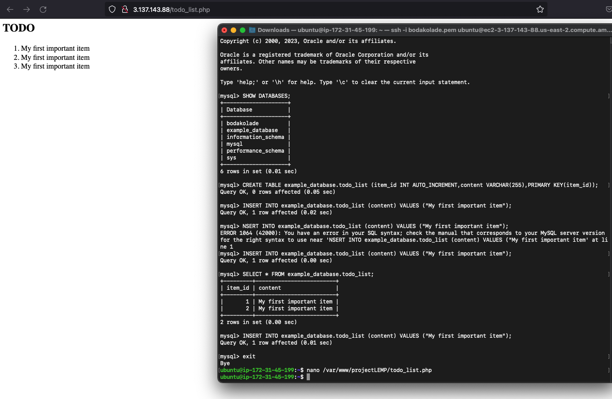

# **PROJECT 2**
## INSTALING NGINX WEB SERVER
`sudo apt update`

`sudo apt install nginx`

`sudo systemctl status`

## INSTALLING MYSQL
`sudo apt install mysql-server`

`sudo mysql`

`sudo mysql_secure_installation`

`sudo mysql -p`

## INSTALLING PHP
`sudo apt install php-fpm php-mysql`

## CONFIGURING NGINX
`sudo mkdir /var/www/projectLEMP`

`sudo chown -R $USER:$USER /var/www/projectLEMP`

`sudo nano /etc/nginx/sites-available/projectLEMP`

`sudo ln -s /etc/nginx/sites-available/projectLEMP /etc/nginx/sites-enabled/`

`sudo nginx -t`

`sudo unlink /etc/nginx/sites-enabled/default`

`sudo systemctl reload nginx`

`sudo echo 'Hello LEMP from hostname' $(curl -s http://169.254.169.254/latest/meta-data/public-hostname) 'with public IP' $(curl -s http://169.254.169.254/latest/meta-data/public-ipv4) > /var/www/projectLEMP/index.html`

## TESTING PHP WITH NGINX
`sudo nano /var/www/projectLEMP/info.php`

 because apache wasnt disabled

`sudo rm /var/www/your_domain/info.php`

## RETRIEVING DATA FROM MYSQL WITH PHP
`sudo mysql`
mysql> CREATE DATABASE bodakolade;
mysql> CREATE DATABASE example_database;
mysql>  CREATE USER 'example_user'@'%' IDENTIFIED WITH mysql_native_password BY 'password';
mysql> GRANT ALL ON example_database.* TO 'example_user'@'%';
mysql> exit

`mysql -u example_user -p`

`mysql> SHOW DATABASES;`

`CREATE TABLE example_database.todo_list (item_id INT AUTO_INCREMENT,content VARCHAR(255),PRIMARY KEY(item_id));`

`mysql> INSERT INTO example_database.todo_list (content) VALUES ("My first important item");`

`mysql>  SELECT * FROM example_database.todo_list;`

`nano /var/www/projectLEMP/todo_list.php`

